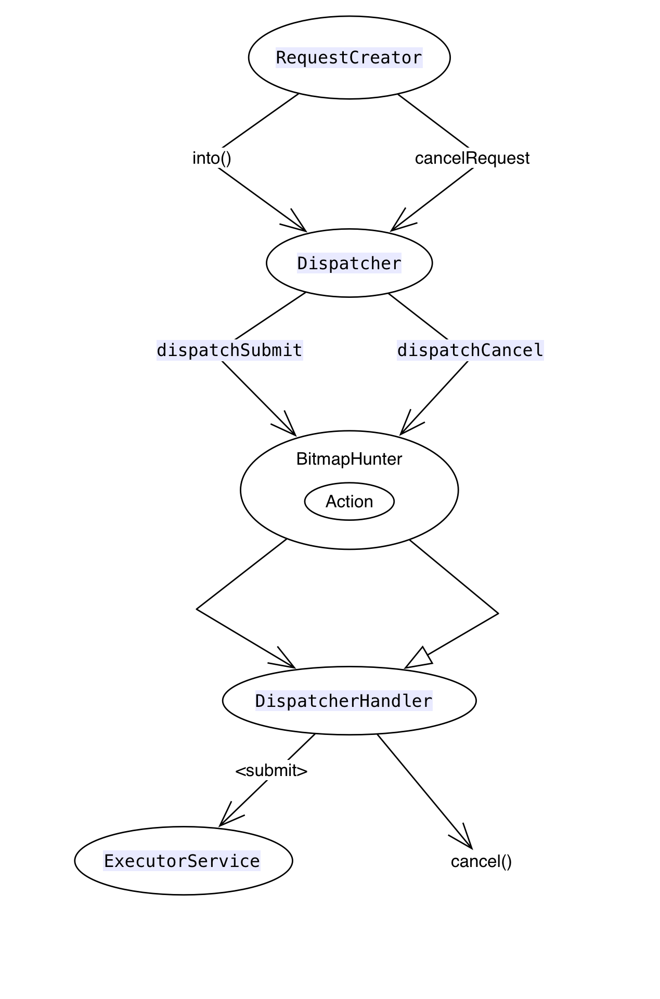

####Picasso源码分析

**参考文章**

- [Android 三大图片缓存原理、特性对比 - 作者：Trinea](http://codekk.com/blogs/detail/565549e2fbbec781c2f75821)

#####1.最简单的使用方式；

~~~java
Picasso.with(activity)
.load(mImageUrl)
.resizeDimen(100,200)
.into(mTargetView);
~~~
#####2.默认的图片加载线程池**PicassoExecutorService**；

核心|最大|存活时间|单位|队列
:-:|:-:|:-:|---|----
&nbsp;&nbsp;&nbsp;3&nbsp;&nbsp;|&nbsp;&nbsp;&nbsp;3&nbsp;&nbsp;&nbsp;|&nbsp;&nbsp;&nbsp;&nbsp;&nbsp;&nbsp;&nbsp;0&nbsp;&nbsp;&nbsp;&nbsp;&nbsp;&nbsp;&nbsp;|MILLISECONDS|PriorityBlockingQueue

#####3.根据网络状态自动调整线程池的大小；
  
  网络状态|线程数量
  :---|:-:
  wifi/winmax/ethernet|4
  (4G)LTE/hspap/ehrpd|3
  (3G)umts/cdma/evdo_(0/a/b)|2
  (2G)gprs/edge|1
  其它|3
  
  通过监听网络变化的广播(ConnectivityManager.CONNECTIVITY_ACTION)来达到调整线程池的目的。具体设置的方法为：
  
  ~~~java
  com.squareup.picasso.PicassoExecutorService
  void adjustThreadCount(NetworkInfo info)
  ~~~
  在Picasso对象创建的时候，注册监听了BroadcastReceiver。
#####4.Picasso使用了单例模式；

~~~java
public static Picasso with(@NonNull Context context) {
    if (context == null) {
      throw new IllegalArgumentException("context == null");
    }
    if (singleton == null) {
      synchronized (Picasso.class) {
        if (singleton == null) {
          singleton = new Builder(context).build();
        }
      }
    }
    return singleton;
  }
~~~
每一次调用加载图片的时候，都校验了单例对象；**Builder**类专门用来创建Picasso这个单例对象；
#####5.Picasso默认创建时的参数；

  下载器|缓存机制|执行器|转换器(Request)
  :---|:-:|:--|:--
    API>=9:okhttp3.OkHttpClient API<9:com.squareup.okhttp.OkHttpClient| LruCache | PicassoExecutorService |RequestTransformer.IDENTITY

#####6.默认Picasso对象；

~~~java
/** Create the {@link Picasso} instance. */
    public Picasso build() {
      Context context = this.context;

      if (downloader == null) {
        downloader = Utils.createDefaultDownloader(context);
      }
      if (cache == null) {
        cache = new LruCache(context);
      }
      if (service == null) {
        service = new PicassoExecutorService();
      }
      if (transformer == null) {
        transformer = RequestTransformer.IDENTITY;
      }

      Stats stats = new Stats(cache);

      Dispatcher dispatcher = new Dispatcher(context, service, HANDLER, downloader, cache, stats);

      return new Picasso(context, dispatcher, cache, listener, transformer, requestHandlers, stats,
          defaultBitmapConfig, indicatorsEnabled, loggingEnabled);
    }
~~~

#####7.自定义Picasso对象；

~~~java
// 自定义Picasso
mPicasso = new Picasso.Builder(context)
        .downloader(null) // 下载器，从网络或者disk加载图片，需要实现load()和shutdown()接口；
        .memoryCache(null) // 内存缓存,默认是LruCache；
        .loggingEnabled(true) // 是否打开日志开关，一般DEBUG时，打开开关便于调试；
        .addRequestHandler(null) // 使用非默认的库来扩展加载图片 ；
        .defaultBitmapConfig(null) // 图片质量配置，argb_8888或者其它,默认无；
        .executor(null) // 图片加载任务线程池，默认为PicassoExecutorService;
        .listener(null) // 监听器，只有一个onImageLoadFailed()接口，默认为空;
        .indicatorsEnabled(true) // 是否在图片上显示DEBUG标识,替代debugging(),
        .requestTransformer(null) // 请求转换器，Request提交执行前，进行请求修改，比如使用CDN的话，可以修改url的hostname;
        .debugging(true) // 已经废弃，请使用indicatorsEnabled替代；
        .build() ;
~~~
#####8.类的解析；
######1.RequestCreator

######2.Dispatcher

######3.BitmapHunter

######4.Downloader

#####9.图片请求大致流程；

#####10.支持解析webP图片；
webP图片的判断代码如下：

~~~java
static boolean isWebPFile(InputStream stream) throws IOException {
    byte[] fileHeaderBytes = new byte[WEBP_FILE_HEADER_SIZE];
    boolean isWebPFile = false;
    if (stream.read(fileHeaderBytes, 0, WEBP_FILE_HEADER_SIZE) == WEBP_FILE_HEADER_SIZE) {
      // If a file's header starts with RIFF and end with WEBP, the file is a WebP file
      isWebPFile = WEBP_FILE_HEADER_RIFF.equals(new String(fileHeaderBytes, 0, 4, "US-ASCII"))
          && WEBP_FILE_HEADER_WEBP.equals(new String(fileHeaderBytes, 8, 4, "US-ASCII"));
    }
    return isWebPFile;
  }
~~~
WebP图片文件的前12个字节的文件头标识：

~~~java
  /* WebP file header
     0                   1                   2                   3
     0 1 2 3 4 5 6 7 8 9 0 1 2 3 4 5 6 7 8 9 0 1 2 3 4 5 6 7 8 9 0 1
    +-+-+-+-+-+-+-+-+-+-+-+-+-+-+-+-+-+-+-+-+-+-+-+-+-+-+-+-+-+-+-+-+
    |      'R'      |      'I'      |      'F'      |      'F'      |
    +-+-+-+-+-+-+-+-+-+-+-+-+-+-+-+-+-+-+-+-+-+-+-+-+-+-+-+-+-+-+-+-+
    |                           File Size                           |
    +-+-+-+-+-+-+-+-+-+-+-+-+-+-+-+-+-+-+-+-+-+-+-+-+-+-+-+-+-+-+-+-+
    |      'W'      |      'E'      |      'B'      |      'P'      |
    +-+-+-+-+-+-+-+-+-+-+-+-+-+-+-+-+-+-+-+-+-+-+-+-+-+-+-+-+-+-+-+-+
  */
  private static final int WEBP_FILE_HEADER_SIZE = 12;
  private static final String WEBP_FILE_HEADER_RIFF = "RIFF";
  private static final String WEBP_FILE_HEADER_WEBP = "WEBP";
~~~

