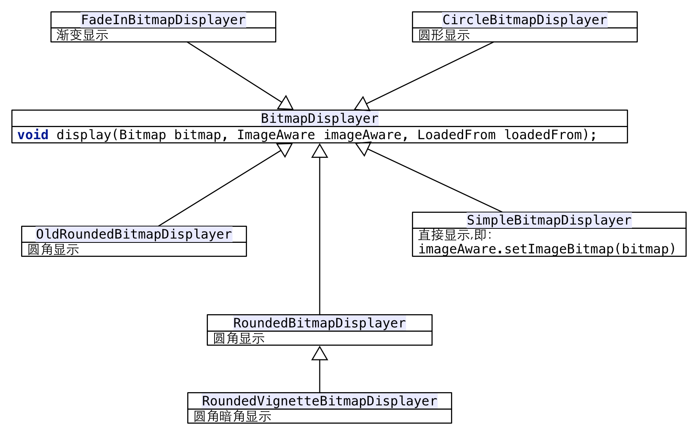
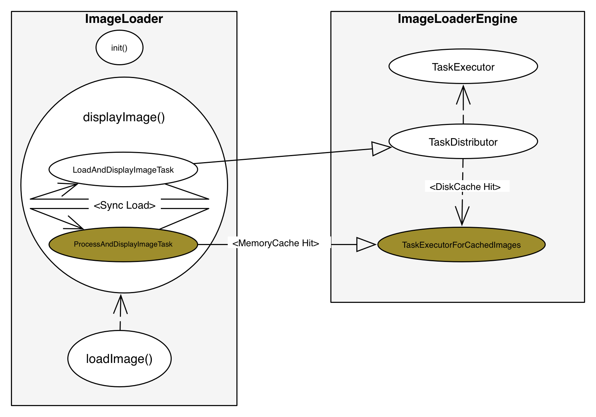

####UniversalImageLoader图片加载库源码分析总结：

#####1.支持bitmap预处理;

  预处理接口为__BitmapProcessor.java__ ，源码如下：
				
	public interface BitmapProcessor {
	/**
	 * Makes some processing of incoming bitmap. 
	 * This method is executing on additional thread (not on UI thread). 
	 * <b>Note:</b> If this processor is used as {@linkplain DisplayImageOptions.Builder#preProcessor(BitmapProcessor)
	 * pre-processor} then don't forget {@linkplain Bitmap#recycle() to recycle} incoming bitmap if you return a new
	 * created one.
	 *
	 * @param bitmap Original {@linkplain Bitmap bitmap}
	 * @return Processed {@linkplain Bitmap bitmap}
	 */
	Bitmap process(Bitmap bitmap);
	}
			
代码只有process一个方法，传入一个bitmap参数 ，返回一个bitmap ,具体实现接口时，可以对传入的bitmap进行处理，然后返回一个新的bitmap对象，当然，如果是新的对象的话，记得要调用传入的bitmap的recycle方法；

源码中定义了**preProcessor**和**postProcessor**2个对象，

**preProcessor**：前处理，当bitmap没有在内存缓存中时，会从资源中加载，加载完成后，会调用preProcessor返回处理后的bitmap对象，并保存到内存缓存中，这一过程主要在LoadAndDisplayImageTask类的run方法里面处理；

**postProcessor**：后处理，当bitmap对象从内存中取出来，需要使用时，会调用postProcessor进行预处理，后处理这个过程在ProcessAndDisplayImageTask类和LoadAndDisplayImageTask类中都有处理。
  
**preProcessor**和**postProcessor**都是通过builder外部传入，源码默认没有实现，一般可能用来处理图片的水印，滤镜等；

#####2.支持自字义discCache的文件名称；

自定义的方法：public ImageLoaderConfiguration.Builder **diskCacheFileNameGenerator**(FileNameGenerator fileNameGenerator)；

	public interface FileNameGenerator {

	/** Generates unique file name for image defined by URI */
	String generate(String imageUri);
	}

通过imageUri生成文件名称，默认实现为获取imageUri的哈希码做为文件名：

	public class HashCodeFileNameGenerator implements FileNameGenerator {
	@Override
	public String generate(String imageUri) {
		return String.valueOf(imageUri.hashCode());
	}
	}

#####3.支持自定义BitmapDisplayer；

 **BitmapDisplayer**用来表示bitmap在UI上的显示方式，比如渐显动画显示，圆角等，内置5种类型的Displayer；
 
 
 
需要自定义显示图片的同学，可以实现**BitmapDisplayer**接口，比如需要圆角显示 ，则创建一个圆角半径为20像素的RoundedBitmapDisplayer对象：

	BitmapDisplayer roundDisplayer = new RoundedBitmapDisplayer(20);
然后在加载具体的图片时，通过：

	DisplayImageOptions options = new DisplayImageOptions.Builder().displayer(roundDisplayer).build();
	
显示时直接调用：

	ImageLoader.getInstance().displayImage(imageUrl, imageView, options);

#####4.支持各种资源URI：file,http/s,res等;

先看源码中的定义：

	HTTP("http"), HTTPS("https"), FILE("file"), CONTENT("content"), ASSETS("assets"), DRAWABLE("drawable"), UNKNOWN("");
	
从源码中我们可以看到，UIL支持的资源有以下几种：

scheme | 描述 | 例子
:|:|
http | 从网络获取 |"http://site.com/image.png"
https| 从网络获取 |"https://site.com/image.png"
file | 本地文件路径|"file:///mnt/sdcard/image.png"
content | android content provider|"content://media/external/images/media/13"
assets| android app assets 目录|"assets://image.png"
drawable | android drawable资源|"drawable://" + R.drawable.image
 

#####5.支持同步加载和异步加载；

同步加载只有在**ImageLoader.loadImageSync()**方法中使用，方法同步返回bitmap:

	public Bitmap loadImageSync(String uri, ImageSize targetImageSize, DisplayImageOptions options) {
		if (options == null) {
			options = configuration.defaultDisplayImageOptions;
		}
		options = new DisplayImageOptions.Builder().cloneFrom(options).syncLoading(true).build();

		SyncImageLoadingListener listener = new SyncImageLoadingListener();
		loadImage(uri, targetImageSize, options, listener);
		return listener.getLoadedBitmap();
	}
除非调用上面的加载方法，其它调用都是使用异步加载，使用**ImageLoadingListener**回调获取bitmap对象。

#####6.支持列表滑动时暂停加载，停止时继续加载.

如果在我们的应用中存在整个列表都是图片组成的话，那么一般在列表滚动的情况下，为了提升用户体验，我们是不需要进行图片加载的，然后在列表滚动结束后，再继续加载图片任务，我们可以通过UIL的**PauseOnScrollListener**来实现这个功能。

	public class PauseOnScrollListener implements OnScrollListener 
我们看，这个类其实也是实现了**AbsListView.OnScrollListener**的这个接口，下面我们主要看看滑动状态改变时，是怎样来加载图片任务的：

	
	@Override
	public void onScrollStateChanged(AbsListView view, int scrollState) {
		switch (scrollState) {
			case OnScrollListener.SCROLL_STATE_IDLE:
				imageLoader.resume();
				break;
			case OnScrollListener.SCROLL_STATE_TOUCH_SCROLL:
				if (pauseOnScroll) {
					imageLoader.pause();
				}
				break;
			case OnScrollListener.SCROLL_STATE_FLING:
				if (pauseOnFling) {
					imageLoader.pause();
				}
				break;
		}
		if (externalListener != null) {
			externalListener.onScrollStateChanged(view, scrollState);
		}
	}
	
通过源码我们看到，列表的不同的滑动状态时，会回调imageLoader的resume和pause方法，而这2个方法就是来控制图片任务是否执行的，我们先看看pause()方法的具体实现：

	void pause() {
		paused.set(true);
	}
方法体比较简单，paused是一个**AtomicBoolean**，设置为**true** ,表示当时是暂停状态；
再看看resume()方法的具体实现：

	void resume() {
		paused.set(false);
		synchronized (pauseLock) {
			pauseLock.notifyAll();
		}
	}
将paused布尔值设置为**false** ,同时，同步块里面调用**notifyAll()**，唤醒所有加载任务，既然有**notify** ,当然就会有对应的**wait** ,想想应该是在加载图片的任务里面处理的，那就是**LoadAndDisplayImageTask**的**run**方法了：

	
	@Override
	public void run() {
		if (waitIfPaused()) return;
		// other code ....
	}
没错，run()方法的第一句就是判断是否暂停任务了，进入**waitIfPaused()**具体看看：

	private boolean waitIfPaused() {
		AtomicBoolean pause = engine.getPause();
		if (pause.get()) {
			synchronized (engine.getPauseLock()) {
				if (pause.get()) {
					L.d(LOG_WAITING_FOR_RESUME, memoryCacheKey);
					try {
						engine.getPauseLock().wait();
					} catch (InterruptedException e) {
						L.e(LOG_TASK_INTERRUPTED, memoryCacheKey);
						return true;
					}
					L.d(LOG_RESUME_AFTER_PAUSE, memoryCacheKey);
				}
			}
		}
		return isTaskNotActual();
	}
好的，源码很明白，我们找到了对应的**wait()**方法；

#####7.支持自定义线程池；

**ImageLoaderEngine**里面定义了3个线程池：

	private Executor taskExecutor;
	private Executor taskExecutorForCachedImages;
	private Executor taskDistributor;

变量名|描述| 核心数|非核心数|队列类型|线程生命周期
-|:---------|:------:|:------:|:------:|:------:|
taskExecutor|非内存缓存加载任务|3|3|FIFO|0
taskExecutorForCachedImages|内存缓存加载任务|3|3|FIFO|0
taskDistributor|任务分发|0|Integer.MAX_VALUE|SynchronousQueue|60s

其中 ，*taskExecutor*和*taskExecutorForCachedImages*可以自定义。

任务分发和运行可以简单用下图表示：

 